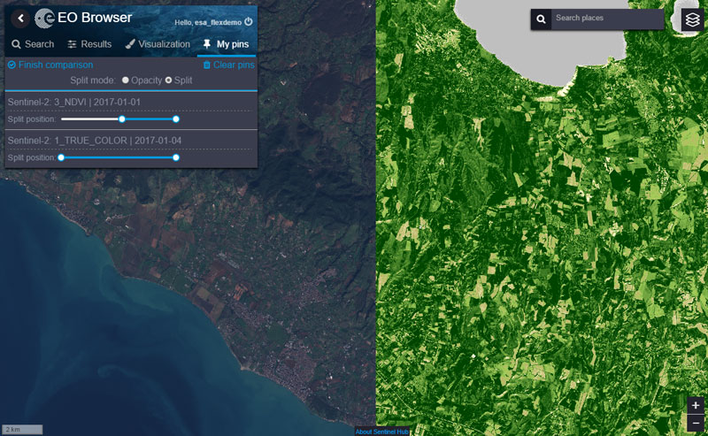

## About

The Earth Observation Browser is a search tool for Sentinel-2 and Landsat 5,7,8 satellite imagery. It was released as open-source to bring earth observation imagery closer to its end users.
Some features:

* Search by date, location, source, and cloud coverage
* Tweak imagery rendering parameters and settings on-the-fly, similar to [Sentinel Playground](http://apps.sentinel-hub.com/sentinel-playground/)
* Pin your results and make opacity or split image comparisons of pinned tiles

## Usage

* Run `npm install` or `yarn`
* Run `npm start`
* Use Sentinel username and password (if you don't have any, contact [Sentinel Hub](www.sentinel-hub.com))

## BUILDING

* yarn build:production
* yarn build:staging

Note about the authentication: might not work.
